# SAMD51_FlashLoaderSD  
### Interesting projects based on extFlashLoader, with more apps added!  
You need to flash the loader menu from extFlashLoader examples first, then copy the unzipped /apps into SD /apps! 
Press/hold the KEY_A and reset the WioTerminal, the SD-Loader menu should start... 
(Works with WioTerminal(SAMD51+ILI9341)) 
### UF2 firmware update: 
Use [bin2uf2.py](https://github.com/jmysu/SAMD51_FlashLoaderSD/blob/main/PlatformIO.projects/bin2uf2.py) (_from Microsoft open source_) to convert SDMENU firmware.bin to sdmenu0x4000.uf2, drag and drop to UF2 bootloader! 
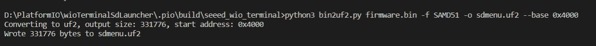

 
 

__SAMD51 Memory Map__  
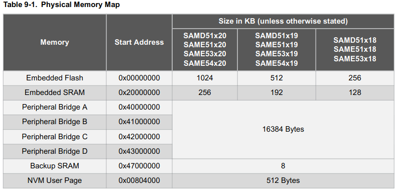  
The memory map for different NVM... 
   

__Zipped apps__  
The zipped apps binary for the following projects! Unzip this and place /apps into SD /apps 
https://github.com/jmysu/SAMD51_FlashLoaderSD/blob/main/PlatformIO.projects/apps.zip 

 
 

__Project SdUSB__ w/ TinyUSB 
Project to turn SD card into USB Mass Storage, for updating SD contents!  
https://github.com/jmysu/SAMD51_FlashLoaderSD/tree/main/PlatformIO.projects/wioTerminal_SdUSB 
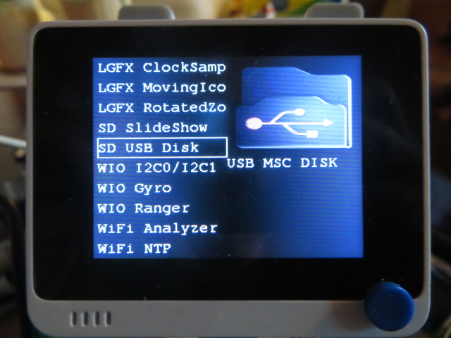 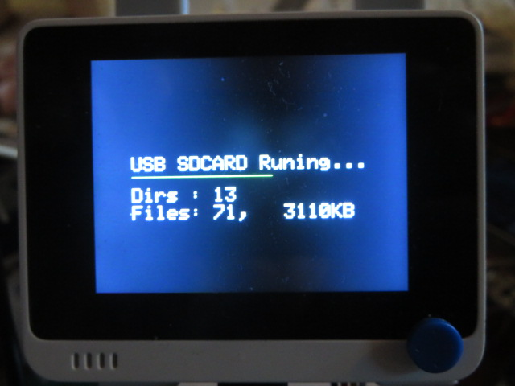  
 
 
__Project SdSlideShow__ w/ JPEGDEC 
Project to decode/show JPEG/GIF files on SD, put jpeg/gif files into SD /TFT floder!  
https://github.com/jmysu/SAMD51_FlashLoaderSD/tree/main/PlatformIO.projects/wioTerminal_JPEGDEC 
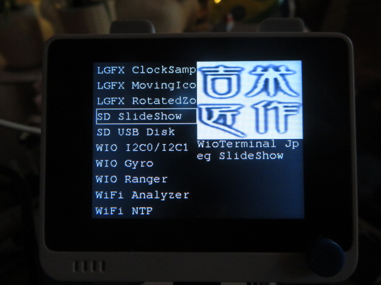   
 
 
__Project I2C Test__ 
Project to test I2C0 && I2C1  
https://github.com/jmysu/SAMD51_FlashLoaderSD/tree/main/PlatformIO.projects/wioTerminal_I2C 
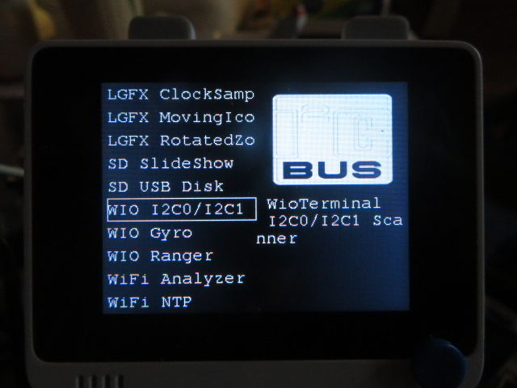 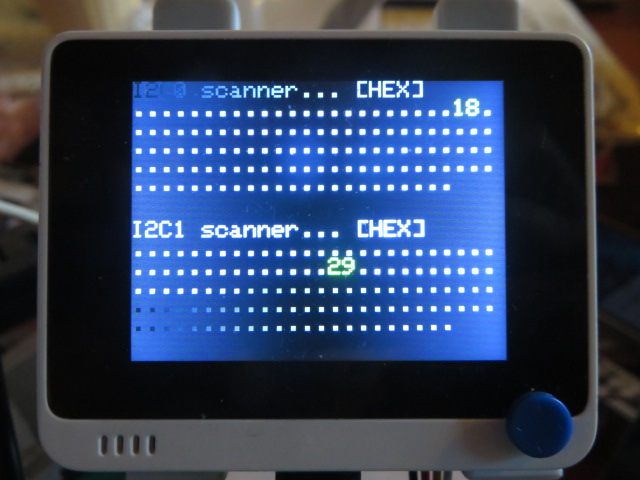  
 
 
__Project Gyro Leveler__ 
Project for gyro leveler (internal LIS3DHTR)  
https://github.com/jmysu/SAMD51_FlashLoaderSD/tree/main/PlatformIO.projects/wioTerminal_Gyro 
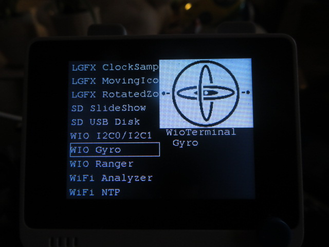 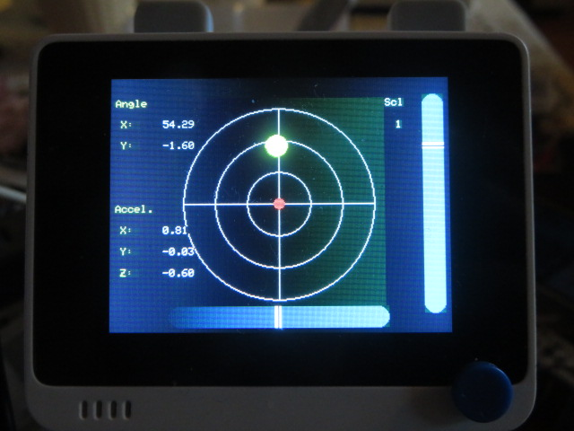  
 
 
__Project VcSel Ranger__ 
Project for VcSel laser ranger (external VL53L0X)  
https://github.com/jmysu/SAMD51_FlashLoaderSD/tree/main/PlatformIO.projects/wioTerminal_VL53L0X_Ranger 
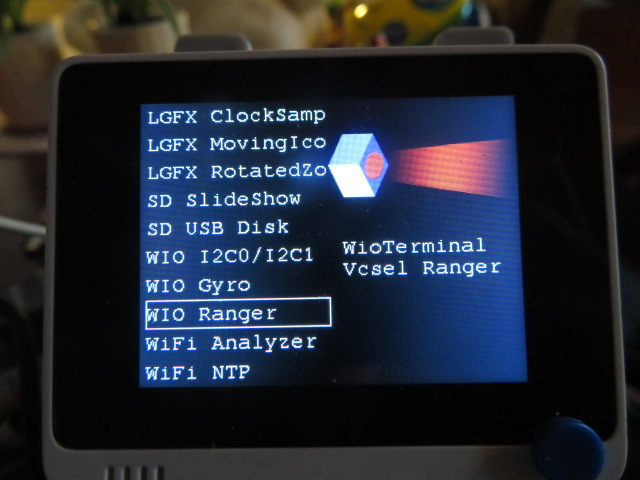 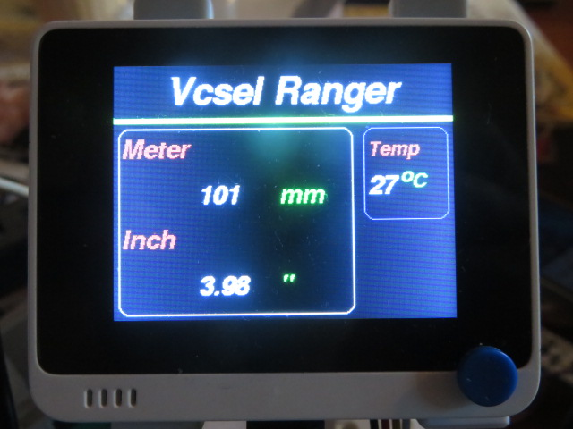  
 
 
__Project WiFi Analyzer__ 
Project to display 2.4G/5G WiFi channels, need latest RPC firmware 2.0.4+  
https://github.com/jmysu/SAMD51_FlashLoaderSD/tree/main/PlatformIO.projects/wioTerminal_WiFiAnalyzer 
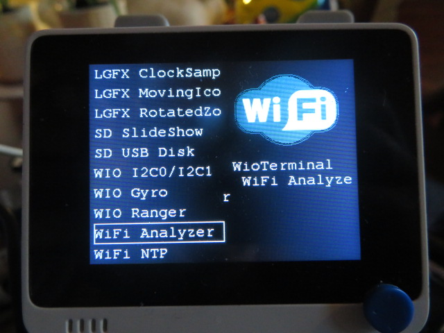 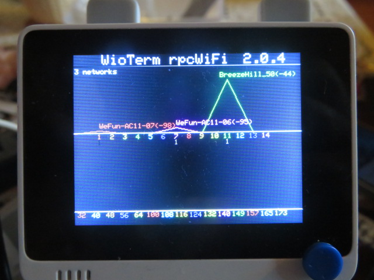  
 
 
__Project WiFi NTP Clock__ 
Project to disply a NTP clock, need latest RPC firmware 2.0.4+  
https://github.com/jmysu/SAMD51_FlashLoaderSD/tree/main/PlatformIO.projects/wioTerminal_WiFi_NTP 
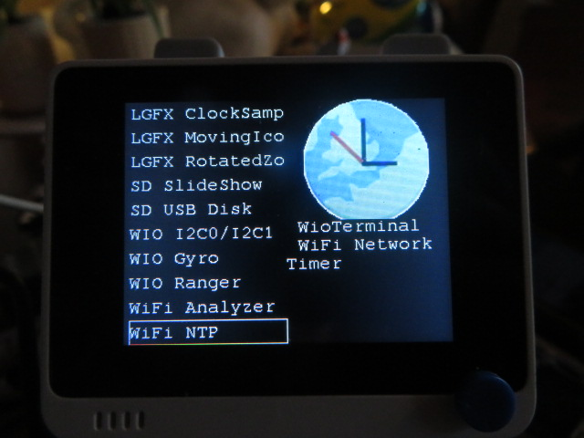 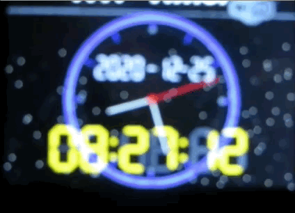  
 
 

## References
  - [SAM BA 3](https://github.com/atmelcorp/sam-ba) Microchip/Atmel SAM boot assistant V3 (Win/Linux cmd line).
  - [bin2uf2](https://github.com/microsoft/uf2-samdx1) USB Mass Storage bootloader (based on UF2) for SAMD21 and SAMD51.
  - [extFlashLoader](https://github.com/ciniml/ExtFlashLoader) WioTerminal extFlashLoader library from SD card.
  - [WioTerminal Flash Loader](https://github.com/ciniml/WioTerminalSimpleLoader) MPLAB Harmony Flash Loader from SD.
  - [LovYanGFX](https://github.com/lovyan03/LovyanGFX) Another nice library for Arduino TFT.
  - [JPEGDEC](https://github.com/bitbank2/JPEGDEC) Another optimized JPEG Decoder for Arduino.
